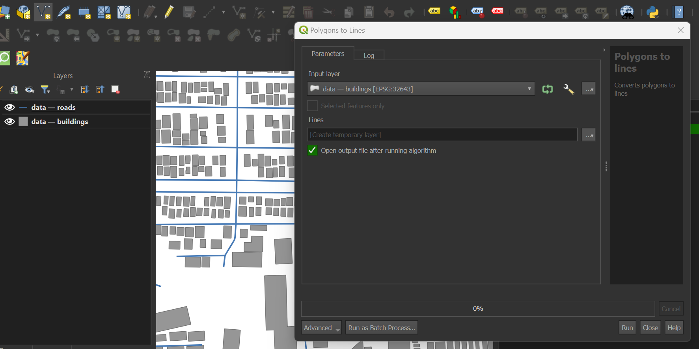
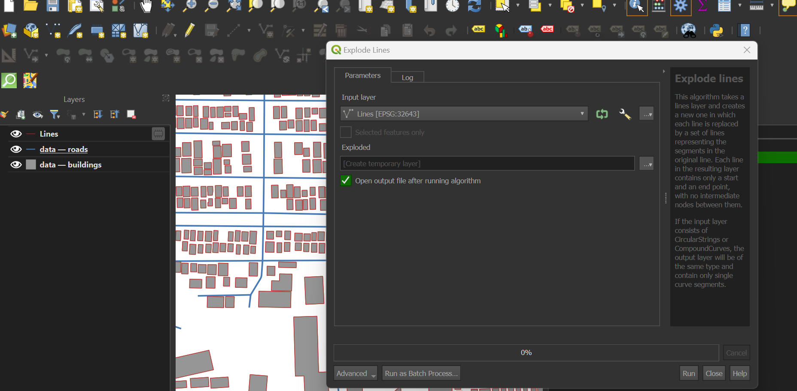
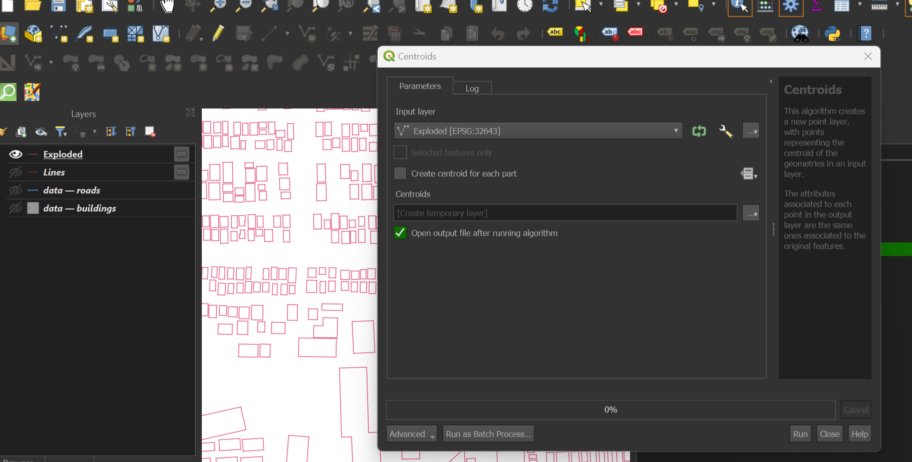
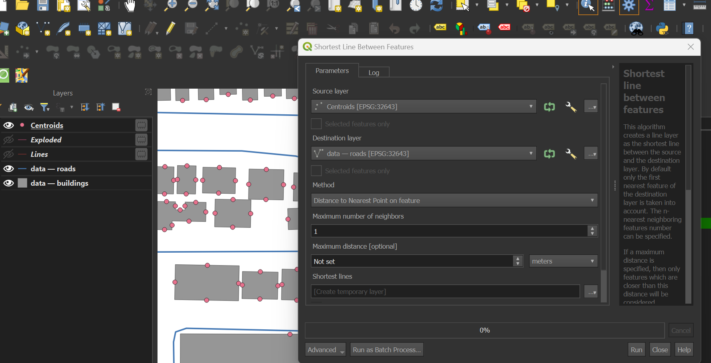
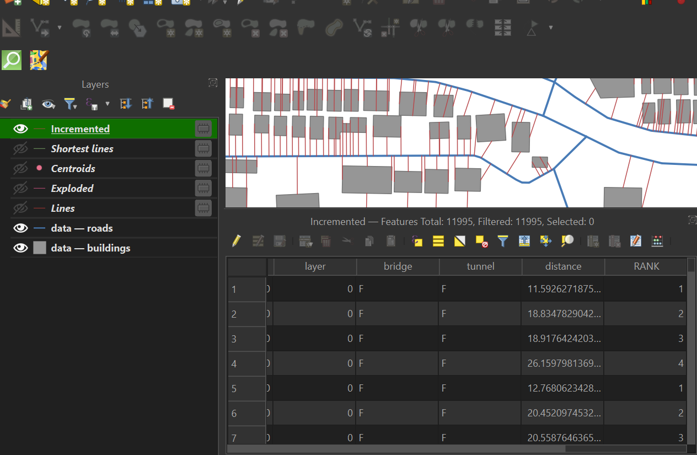
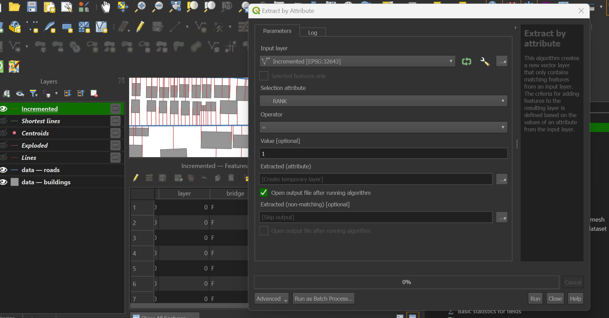

# Challenge: Connect Each Building’s Road Facing Edge to the Nearest Point on the Street Segment

## Challenge Overview
In this challenge, the goal is to connect each building's road-facing edge to the nearest point on the street segment. This involves manipulating spatial data to ensure that each building is accurately represented in relation to its nearest road.

## Steps to Solve 

1. Data Preparation:
 Download data from: export=[download&id=1NfD44cwNDgSt_ukDWc2RzgR0R2Gg3ISe](https://drive.google.com/uc?export=download&id=1NfD44cwNDgSt_ukDWc2RzgR0R2Gg3ISe)
2. Polygons to Lines(Processing Toolbox > Polygons to Lines): Convert building polygons into line segments representing their edges.

3. Explode Lines (Processing Toolbox > Explode Lines): Break down any multi-part line geometries into individual line segments for easier processing.

4. Calculate Centroids (Processing Toolbox > Centroids):
 For each line segment created from the building polygons, calculate the centroid. This centroid will serve as the point from 
 which we measure distance to the nearest road.

5. Shortest Line Calculation (Processing Toolbox > Shortest Line between features):
 Use the Shortest Line function to find the shortest distance between each centroid of the building segments and the road vector file.

6. Add Auto-Incremental Field (Processing Toolbox > Explode Lines):
 Create an auto-incremental field to generate unique IDs for each connection(_preferably named RANK_).
_Sort by expression(fid)_
 _Group by distance_ to organize connections effectively.

8. Extract by Attribute(Processing Toolbox > Extract by Attribute(Rank, Value=1):
 Use the Extract by Attribute function to filter results based on a specified criterion (e.g., Rank, Value=1).

